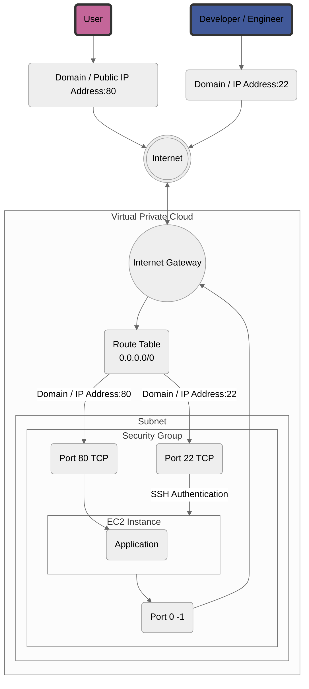

# Project Overview

Built and deployed two .NET Microservices using the REST API pattern.

## Details

- Dedicated persistence layers for both services
- Deployed services to a Kubernetes cluster
- Employed the API Gateway pattern for routing
- Implemented synchronous messaging between services using HTTP and gRPC
- Built asynchronous messaging between services using an Event Bus (RabbitMQ)
- IaC and scripting for automated deployment and portability

## Technologies

- [.NET](https://dotnet.microsoft.com/en-us/)
- [Apache](https://www.apache.org/)
- [AWS](https://aws.amazon.com/)
- [C#](https://learn.microsoft.com/en-us/dotnet/csharp/)
- [curl](https://curl.se/)
- [Docker](https://learn.microsoft.com/en-us/dotnet/csharp/)
- [gRPC](https://grpc.io/)
- [k9s](https://github.com/derailed/k9s?ref=terminaltrove)
- [Kubernetes](https://kubernetes.io/)
- [Kubetui](https://github.com/sarub0b0/kubetui)
- [Lazydocker](https://github.com/jesseduffield/lazydocker)
- [Lazygit](https://github.com/jesseduffield/lazygit)
- [Linux](https://archlinux.org/) => Arch (development) & Ubuntu (production)
- [localtunnel](https://theboroer.github.io/localtunnel-www/)
- [Microsoft SQL Server](https://www.microsoft.com/en-us/sql-server/sql-server-downloads)
- [Minikube](https://minikube.sigs.k8s.io/docs/)
- [Nginx](https://kubernetes.github.io/ingress-nginx/deploy/)
- [Posting](https://github.com/darrenburns/posting)
- [RabbitMQ](https://www.rabbitmq.com/)
- [Swagger](https://swagger.io/why-swagger/)
- [Terraform](https://www.terraform.io/)

## References

- [S04E03---.NET-Microservices-Course-](https://github.com/binarythistle/S04E03---.NET-Microservices-Course-)
- [scholzj/aws-minikube](https://github.com/scholzj/aws-minikube)
- [cloud-formation-minikube](https://github.com/kobbikobb/cloud-formation-minikube)

## Solutions Architecture & Systems Design

### Solutions Architecture (Single System)

### AWS Cloud Architecture

